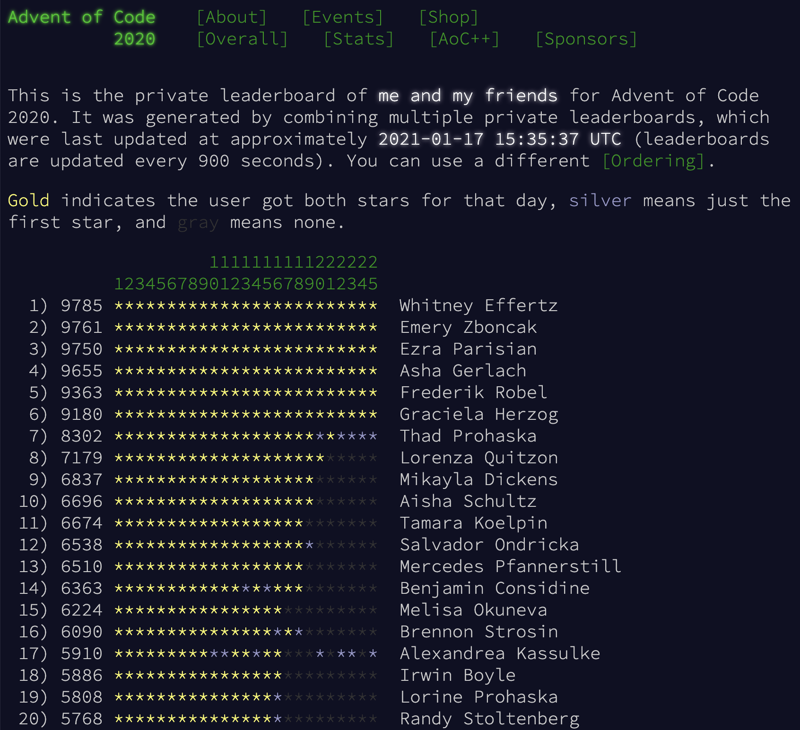
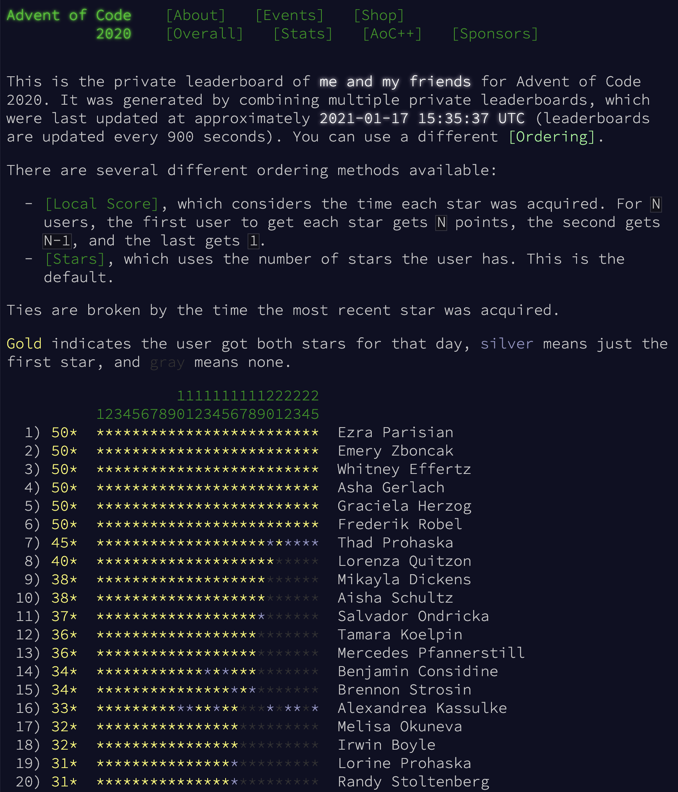
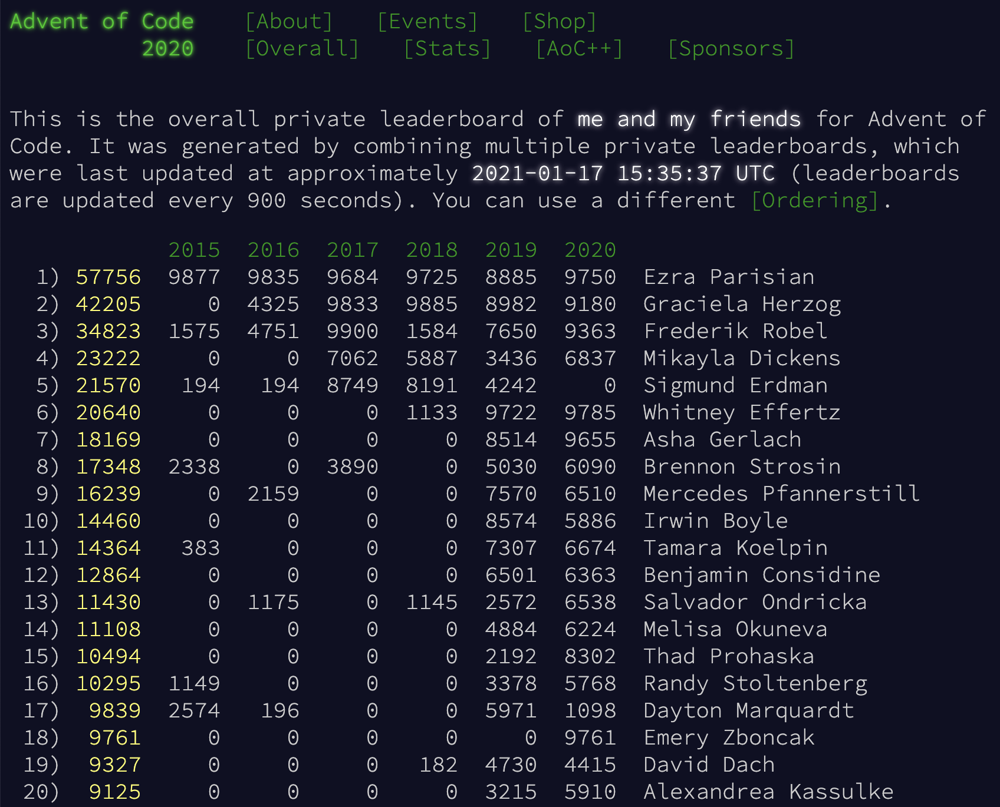

# aocleaderboard

[Advent of Code](https://adventofcode.com) private leaderboards are currently
limited to 200 users. This web app can merge users from multiple
leaderboards, recalculate their scores based on the total number of members, and
present them in a single page with the same look and feel of the original
Advent of Code website. It can also show an overall leaderboard with scores
for all years combined.

Leaderboards are fetched in JSON format from the
[adventofcode.com](https://adventofcode.com) API URL.

## Screenshots

Leaderboard with local score:



Leaderboard with star count:



Overall leaderboard:



## Requirements

This app is built with [Rocket](https://rocket.rs) web framework and, therefore,
requires a _nightly_ version of Rust.

## Install

- Install a recent version of Rust using [rustup](https://rustup.rs/) or update
it with:
```
# rustup update
```

- Install the nightly toolchain:
```
# rustup toolchain install nightly
```

- Clone this repo:
```
# git clone https://github.com/scarvalhojr/aocleaderboard.git
```

- Set the repo directory to use the nightly toolchain:
```
# cd aocleaderboard
# rustup override set nightly
```

- Build:
```
# cargo build --release
```

## Configure

### Required configuration

- Make a copy of [settings_sample.toml](settings_sample.toml) called
  `settings.toml`:

```
# cp settings_sample.toml settings.toml
```

- Edit the new `settings.toml` file and provide a list of private leaderboard
  IDs along with a leaderboard name and a session cookie from adventofcode.com
  with access to the leaderboards.

```
leaderboard_name = "me and my friends"
leaderboard_ids = [12345, 23456]
session_cookie = "session=<session cookie string>"
```

To obtain the session cookie, login to [adventofcode.com](adventofcode.com)
and inspect the cookie stored in your browser. You must be a member of the
leaderboards in order to fetch their data - check your leaderboards at
[https://adventofcode.com/leaderboard/private](https://adventofcode.com/leaderboard/private).

### Other settings

- In `settings.toml`:
  - `leaderboard_default_order` - default leaderboard ordering, either
    `"local_score"` (default) or `"stars"`.
  - `leaderboard_update_sec` - how often to fetch leaderboards from
    adventofcode.com, in seconds.
  - `latest_event_year` - override the latest event year, which by default is
    the current year or the previous year if the current date is before Dec 1st
    (when first puzzle unlocks).
  - `exclude_members` - a list of member IDs to exclude from leaderboard.

- To change any Rocket-specific settings, e.g. path to TLS certs an keys, or
  IP address and binding port, make a copy of
  [Rocket_sample.toml](Rocket_sample.toml) called `Rocket.toml`.

## Run

Start the app:

```
# cargo run --release
```

## Use

Point your favourite browser to [http://localhost:8000](http://localhost:8000).

## Features

- To avoid overloading the Advent of Code website, leaderboards are cached in
   memory and fetched again after a configurable time limit (by default, 15
   minutes).
- Leaderboards can be ordered by local score (based on the time each star was
  acquired) or by number of stars. Ties are broken by the time the most recent
  star was acquired.
- Overall leaderboard combines scores from all years.

## Contribute

Feedback and pull requests are welcome.

## Support Advent of Code

Advent of Code is a free online Advent calendar of small programming puzzles
created by [Eric Wastl](http://was.tl/) and maintained by volunteers. Please
consider [supporting their work](https://adventofcode.com/support).


